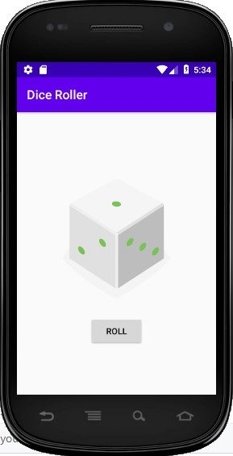

# Dice Roller App
Android App in Kotlin

# My Learnings

- Changing commit message after a push
```
git rebase -i HEAD~n
git push --force-with-lease
```

- Using Vector drawables for
[image scalability](https://developer.android.com/guide/topics/graphics/vector-drawable-resources)

# Screenshot


